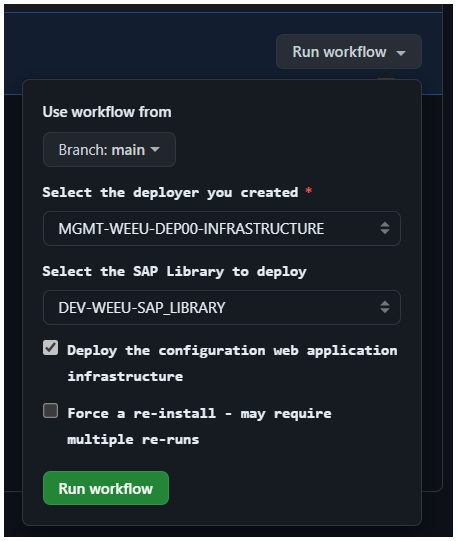

# Use SAP Deployment Automation Framework from GitHub

GitHub streamlines the deployment process by providing workflows that you can run to perform the infrastructure deployment and the configuration and SAP installation activities.

You can use GitHub Repos to store your configuration files and use GitHub Actions to deploy and configure the infrastructure and the SAP application.

## Sign up for GitHub

To use SAP Deployment Automation Framework from GitHub, you need to have a GitHub organization and the right permissions to create a repository.

## Create a new GitHub repository

Use the `https://github.com/XpiritBV/azure-sap-automation-deployer` repository template as a starting point for your own repository. Click the [**Use this template**](https://github.com/new?template_name=azure-sap-automation-deployer&template_owner=XpiritBV) button to create a new repository based on the template.

> [!NOTE]
> The GitHub Actions is using Environments to store secrets and variables. Make sure your repository can use the [environments feature](https://docs.github.com/en/actions/deployment/targeting-different-environments/using-environments-for-deployment) and the Issues feature is enabled.

After you created the repository, there will be an Issue created with the title "**Create GitHub App**". This issue contains the steps to configure a GitHub App for the repository.

## Create a GitHub App issue

Before you start creating a deployer, you need to set-up credentials. Let's start with creating a GitHub app, so you can get and set variables and credentials, create and update issues, and register a GitHub runner to deploy the SAP environment.

This app needs the following repository permissions only for **this** repository:
  - Administration: Read & Write (Setting up the GitHub Runner on the deployer VM)
  - contents: Read & Write (Creating configuration files, and update workflow with deployer and library)
  - Environments: Read & Write (Creating environments)
  - Secrets: Read & Write (Used to store secrets in the first step, as there's no App configuration yet)
  - Variables: Read & Write (Used to store variables in the first step, as there's no App configuration yet)
  - Workflows: Read & Write (Creating configuration files, and update workflow with deployer and library)

1. You can use the following link to create the app requirements automagically: https://github.com/settings/apps/new?description=Used%20to%20create%20environments,%20update%20and%20create%20secrets%20and%20variables%20for%20your%20SAP%20on%20Azure%20Setup.&callback=false&request_oauth_on_install=false&public=true&actions=read&administration=write&contents=write&environments=write&issues=write&secrets=write&actions_variables=write&workflows=write&webhook_active=false&events[]=check_run&events[]=check_suite

2. Generate a private key
  - Click on `Generate a private key`
  - Save the private key in the **repository secrets** as  `APPLICATION_PRIVATE_KEY`
  - Save the App ID in the **repository secrets** as `APPLICATION_ID`

3. Install the app on the organization
  - Click on `Install App` and select the organization where you want to deploy the SAP deployment.
  - Select the repository to grant privileges to the app.

  **Note**: If you don't have permissions in your organization, your organization administrator will receive a request to install the app.

When this is done, you can close this issue and new issues using the issue template **create a new environment**.

## Create a new environment

If you want to start to create a new environment to start deploying a deployer, you can do this by creating a new issue on your cloned mirror repository and select the `Create Environment` on tap.

When you open this form, you can enter the name of your environment (e.g. acc, dev, prd, etc. Max 5 characters.),the Azure region you want to deploy to and the VNET your deployer needs to be added to/needs to be created. **note** [more info on the naming convention](https://learn.microsoft.com/en-us/azure/sap/automation/naming).

After you clicked `Submit new issue` a GitHub worklow will be triggered which will create an environment on GitHub to store configuration values and create the configuration file with default settings in your repository. You can look in the `WORKSPACES/DEPLOYER` and `WORKSPACES/LIBRARY`. Depending on your Azure set-up you need to configure this file to make sure the Deployer is using the correct subnet, vnet, private endpoints, etc. **note** [more information about customizing the control plane](https://learn.microsoft.com/en-us/azure/sap/automation/configure-control-plane).

# Link Azure to GitHub issue

The next thing we need to do do be able to setup our deployer on Azure, is to [connect GitHub and Azure together using OpenID connect](https://learn.microsoft.com/en-us/azure/developer/github/connect-from-azure?tabs=azure-portal%2Clinux#set-up-azure-login-with-openid-connect-authentication). Please follow this link, and create the following secrets:

- Application (client) ID: as `AZURE_CLIENT_ID` in `environment secrets`
- Client secret: as `AZURE_CLIENT_SECRET` in `environment secrets`
- Directory (tenant) ID: as `AZURE_TENANT_ID` in `environment secrets`
- Subscription ID: as `AZURE_SUBSCRIPTION_ID` in `environment secrets`

If you need to deploy the Control Plane Web Application credentials create an app registration as described [here](https://learn.microsoft.com/en-gb/azure/sap/automation/configure-webapp?tabs=linux#create-an-app-registration).

- App registration ID: as `APP_REGISTRATION_APP_ID` in `environment secrets`
- App registration password: as `WEB_APP_CLIENT_SECRET` in `environment secrets`

When you saved these secrets, please close this issue. A workflow will be triggered to validate the configuration. If the configuration is correct, the issue will be closed automatically. If the configuration is incorrect, the issue will be reopened.

# Deploy the Control Plane

The deployment uses the configuration defined in the Terraform variable files located in the `/WORKSPACES/DEPLOYER` and `/WORKSPACES/LIBRARY` folders.

1. In the GitHub repository, navigate to the `Actions` tab.
2. Select the `Deploy Control Plane` workflow.
3. Click the `Run workflow` button and select the configuration name for the deployer and the SAP library.

You can track the progress in the `Actions` tab. After the deployment is finished, you can see the control plane details on the summary output.

## Configure the Web Application authentication issue

If the web app is deployed, you need to configure the web app authentication. The issue  **Configure Web Application authentication** is created and contains the steps to configure the web app authentication.

# GitHub runner troubleshooting

The GitHub runner is a self-hosted runner that runs the GitHub Actions. If you encounter issues with the runner, you can troubleshoot the runner by following these steps.

- Validate the runner is registered in your repository and is **Online** or **Active** in the `Settings` - `Actions` - `Runners` in the GitHub repository.
- Validate the runner is installed on the VM by validating the output of the VM extension Custom Script named `configure_deployer` in the Azure Portal.

## Retry installation of the GitHub runner

The GitHub runner is installed on the Deployer VM in the first step of the deployment. If the runner installation fails, you can retry the installation by following these steps.

- Remove the Custom Script extension `configure_deployer` in the Azure Portal.
- Remove the runner from the GitHub repository.
- Run the `Deploy Control Plane` workflow again, with the `Force a re-install` setting enabled.
